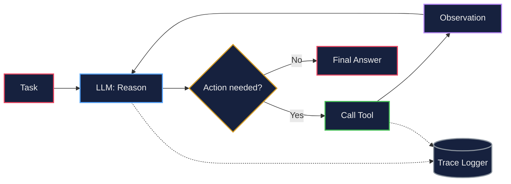
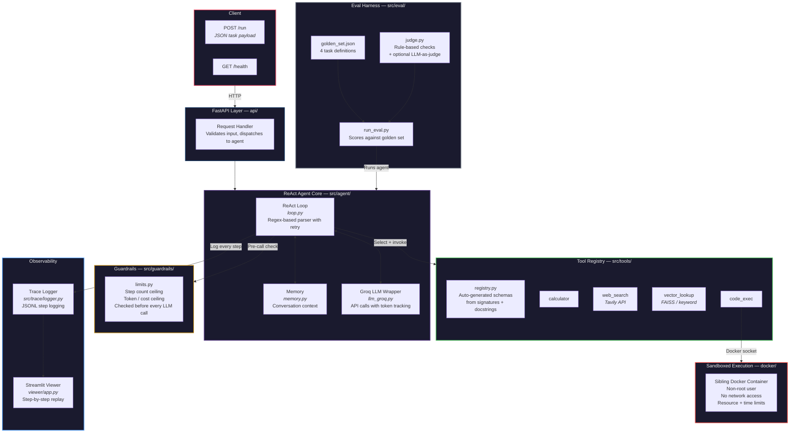
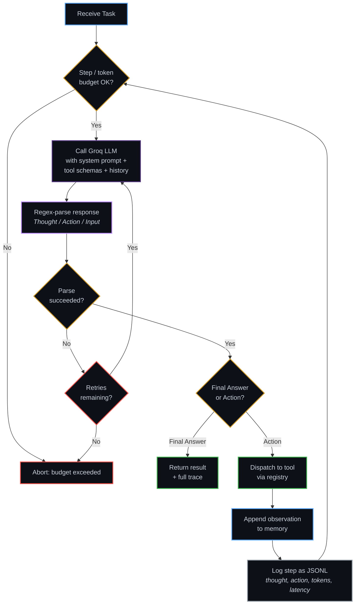
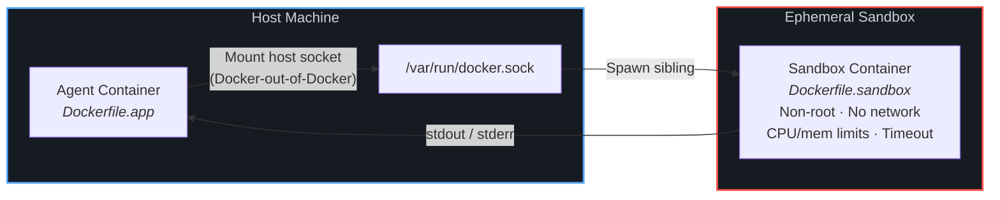

<div align="center">

# LLM Agent From Scratch

**A tool-using ReAct agent built without any agent framework**

[](https://llm-agent-tez2.onrender.com)
[](https://python.org)
[](tests/)
[](src/eval/)
[](LICENSE)

<br/>

*No LangChain. No LangGraph. No CrewAI.*

The reasoning loop, tool-schema generation, memory, evaluation harness, tracing, guardrails, and sandboxed code execution are all hand-rolled — to demonstrate a real understanding of agent internals rather than framework glue.

<br/>

[**Try the Demo →**](https://llm-agent-tez2.onrender.com) · [Architecture](#architecture) · [Quickstart](#quickstart) · [Verified Results](#verified-results)

---

</div>

## Table of Contents

<details>
<summary><b>Click to expand</b></summary>

1. [Why From Scratch?](#why-from-scratch)
2. [What It Does](#what-it-does)
3. [Tools](#tools)
4. [Architecture](#architecture)
5. [Architecture Highlights](#architecture-highlights)
6. [Quickstart](#quickstart)
7. [Usage Examples](#usage-examples)
8. [Verified Results](#verified-results)
9. [Project Structure](#project-structure)
10. [Design Decisions & Trade-offs](#design-decisions--trade-offs)
11. [Known Limitations](#known-limitations)
12. [Roadmap](#roadmap)
13. [License](#license)

</details>

---

## Why From Scratch?

Agent frameworks hide the interesting parts: how tool calls actually get parsed out of raw model output, what happens when the model returns malformed JSON, how you enforce a step budget before the model does it for you, how you sandbox arbitrary code execution safely.

This project builds **all of it directly**, so every piece is inspectable and explainable — down to the regex that parses the model's own output.

> [!NOTE]
> This mirrors the philosophy behind another project in my portfolio — an [AlphaZero-style chess engine](https://github.com/AnshumanJ28/AlphaZ0) built without a Stockfish wrapper: understanding the mechanism matters more than assembling pre-built pieces.

---

## What It Does

Given a task like *"What is 17 × (3 + 5)?"* or *"Search for the latest inflation numbers and summarize them,"* the agent reasons step-by-step, decides which tool to call, observes the result, and repeats until it reaches a final answer — all logged, traced, and constrained by hard step/token budgets.



---

## Tools

| Tool | Description | Fallback Behavior |
|:---|:---|:---|
| `calculator` | Safe AST-based arithmetic evaluation — no bare `eval()` | — |
| `web_search` | Live search via the Tavily API | Clearly labeled mock if no API key is set |
| `vector_lookup` | FAISS + sentence-transformers retrieval | Keyword matching if deps aren't installed |
| `code_exec` | Runs untrusted code in an ephemeral, non-root, network-disabled sibling Docker container | — |

> [!TIP]
> Tool schemas are **not hand-written** — `src/tools/registry.py` auto-generates the JSON schema each tool exposes to the model directly from its function signature and docstring. Adding a new tool never means keeping two definitions in sync.

---

## Architecture

### End-to-End System Architecture



### The ReAct Loop in Detail



### Sandboxed Code Execution



> [!IMPORTANT]
> The sandbox uses **sibling containers** (Docker-out-of-Docker), not Docker-in-Docker. This avoids privileged-mode requirements while still enforcing no network access, a non-root user, and resource/time limits. The trade-off: it requires host Docker socket access.

---

## Architecture Highlights

| Component | What It Does | Why It Matters |
|:---|:---|:---|
| **Hand-written ReAct parser** | Regex-based parsing of `Thought / Action / Input` from raw model output, with a retry loop for malformed responses | The parsing logic — including recovery from bad output — is visible and testable, not hidden inside a framework |
| **Auto-generated tool schemas** | Derived from function signatures and docstrings by `registry.py` | Adding a new tool never means keeping two definitions in sync |
| **Sandboxed execution** | Sibling Docker container via mounted host socket | Enforces no network, non-root, resource limits without privileged-mode DinD complexity |
| **Code-level guardrails** | Step count and token/cost ceilings checked *before* every model call | Hard limits enforced in code, not just requested via the system prompt |
| **Full observability** | Every step logged as JSONL, replayable in Streamlit viewer | Token usage, latency, thoughts, actions — all inspectable per step |
| **Eval harness** | Golden set scored with rule-based checks + optional LLM-as-judge | Right tool called? Within step budget? Deterministic checks first, LLM judge second |
| **CI pipeline** | pytest + eval suite on every push | Eval step skips gracefully if API key secrets aren't configured |

---

## Quickstart

```bash
git clone https://github.com/AnshumanJ28/LLM-agent.git
cd LLM-agent
cp .env.example .env        # add your GROQ_API_KEY (required); TAVILY_API_KEY is optional
pip install -r requirements.txt
docker build -t sandbox_exec -f docker/Dockerfile.sandbox .   # needed for code_exec
```

> [!NOTE]
> `vector_lookup` works out of the box with keyword matching. For real embedding-based retrieval, uncomment `faiss-cpu` and `sentence-transformers` in `requirements.txt` before installing — note this pulls in `torch` and is a much heavier install.

---

## Usage Examples

### Run a single task directly (no API, no Docker)

```bash
python -c "
from src.agent.loop import run_agent
from src.tools.registry import get_tools
from src.tools import calculator, web_search, vector_lookup, code_exec
result = run_agent('What is 17 * (3 + 5)?', get_tools())
print(result.final_answer)
"
```

### Run the full stack (API + trace viewer)

```bash
docker compose -f docker/docker-compose.yml up --build
```

| Service | Endpoint |
|:---|:---|
| Agent API | `POST http://localhost:8000/run` with body `{"task": "..."}` |
| Health check | `GET http://localhost:8000/health` |
| Trace viewer | `http://localhost:8501` |

**Example request:**

```bash
curl -X POST http://localhost:8000/run \
  -H "Content-Type: application/json" \
  -d '{"task": "What is 12 * 7?"}'
```

### Run the eval suite

```bash
python -m src.eval.run_eval
```

### Run tests

```bash
pytest tests/ -v
```

---

## Verified Results

### Unit Tests — 12/12 passing

Covering response parsing (final answer / action / malformed / bad JSON), full-loop completion, step-limit enforcement, recovery from a tool exception, calculator correctness, and rejection of unsafe calculator input.

### Golden Set Evaluation — 4/4 passing

Scored against live Groq + Tavily APIs:

| Task | Tool Used | Steps | Tokens | Latency |
|:---:|:---|:---:|:---:|:---:|
| `calc_1` | calculator | 2 | 823 | 1.86 s |
| `calc_2` | calculator | 2 | 847 | 0.92 s |
| `search_1` | web_search | 5 | 5,062 | 10.69 s |
| `code_1` | code_exec | 2 | 1,872 | 8.56 s |

> [!NOTE]
> `code_exec`'s latency is dominated by Docker container spin-up/teardown per call, not model reasoning time — a known trade-off of the sibling-container sandboxing approach.

---

## Project Structure

```
LLM-agent/
├── src/
│   ├── agent/               # ReAct loop, Groq LLM wrapper, memory
│   │   ├── loop.py          ← Core ReAct reasoning loop with regex parser
│   │   ├── llm_groq.py      ← Groq API wrapper with token tracking
│   │   └── memory.py        ← Conversation context management
│   ├── tools/               # Tool implementations + auto-schema registry
│   │   ├── registry.py      ← Auto-generates JSON schemas from signatures
│   │   ├── calculator.py    ← Safe AST-based arithmetic
│   │   ├── web_search.py    ← Tavily API with mock fallback
│   │   ├── vector_lookup.py ← FAISS / keyword retrieval
│   │   └── code_exec.py     ← Docker sibling container dispatch
│   ├── eval/                # Evaluation harness
│   │   ├── golden_set.json  ← 4 task definitions
│   │   ├── judge.py         ← Rule-based + LLM-as-judge scoring
│   │   └── run_eval.py      ← Evaluation runner
│   ├── trace/               # Observability
│   │   └── logger.py        ← JSONL step logging
│   └── guardrails/          # Safety constraints
│       └── limits.py        ← Step/cost budgets, input sanitization
├── api/                     # FastAPI wrapper (POST /run, GET /health)
├── viewer/                  # Streamlit trace viewer (step-by-step replay)
├── docker/
│   ├── Dockerfile.app       ← Agent + API container
│   ├── Dockerfile.sandbox   ← Ephemeral code execution container
│   ├── Dockerfile.viewer    ← Streamlit trace viewer container
│   └── docker-compose.yml   ← Full stack orchestration
├── tests/
│   ├── test_loop.py         ← ReAct loop + parsing tests
│   └── test_tools.py        ← Tool correctness + safety tests
└── .github/workflows/
    └── ci.yml               ← pytest + eval on every push
```

> [!TIP]
> See [`PROJECT-README.md`](./PROJECT-README.md) for the full original architecture spec this was built from, including the build order and the reasoning behind every design decision.

---

## Design Decisions & Trade-offs

| Decision | Approach | Trade-off |
|:---|:---|:---|
| **Sibling containers** | `code_exec` mounts the host Docker socket to spawn sandboxes as siblings, not Docker-in-Docker | Simpler to reason about, no privileged mode — but requires host socket access, unsuitable for shared PaaS |
| **Regex parsing** | ReAct loop parses raw model text with hand-written regex, not a provider's structured-output API | Parsing logic (including malformed-output recovery) is fully visible and testable |
| **Rule-based eval first** | Deterministic checks (right tool? within budget?) are the primary signal; LLM-as-judge is optional | Reliable, reproducible scoring for well-defined tasks; LLM judge adds coverage for open-ended ones |
| **Graceful degradation** | `web_search` and `vector_lookup` fall back to simpler behavior when deps/keys are missing | Never crashes on a missing optional — but fallback behavior is meaningfully weaker |

---

## Known Limitations

> [!WARNING]
> - `code_exec` requires access to the host Docker socket — it won't work unmodified on most free PaaS platforms (Render, Fly.io, HuggingFace Spaces). A dedicated VM with Docker is needed for full deployment of this tool.
> - The eval golden set is intentionally small (4 tasks) — enough to validate each tool path end-to-end, not a large-scale benchmark.
> - `vector_lookup`'s keyword-matching fallback is meaningfully weaker than real embedding-based retrieval; enabling `faiss-cpu` / `sentence-transformers` is recommended for any serious retrieval use case.

---

## Roadmap

- [ ] Expand the golden set with more open-ended, LLM-judged tasks
- [ ] Add streaming responses from the FastAPI layer
- [ ] Multi-agent handoff (a second, specialized agent for long-form research tasks)

---

## License

MIT — see [`LICENSE`](./LICENSE).

---

<div align="center">

### Built From Scratch

*Reasoning loop · Tool schemas · Memory · Eval harness · Tracing · Guardrails · Sandboxed execution*

**No LangChain. No LangGraph. No CrewAI. No framework glue.**

<br/>

Star this repo if you found it interesting!

---

*Made by [Anshuman](https://github.com/AnshumanJ28)*

</div>
