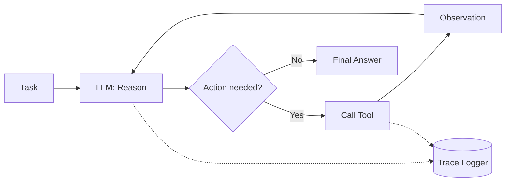

# LLM Agent From Scratch

A tool-using ReAct (Reason + Act) agent built **without any agent framework** —
no LangChain, no LangGraph, no CrewAI. The reasoning loop, tool-schema generation,
memory, evaluation harness, tracing, and sandboxed code execution are all hand-rolled,
to demonstrate a real understanding of agent internals rather than framework glue.


## Why from scratch?

Agent frameworks hide the interesting parts: how tool calls actually get parsed out
of raw model output, what happens when the model returns malformed JSON, how you
enforce a step budget before it enforces itself, how you sandbox arbitrary code
execution safely. This project builds all of it directly so every piece is
inspectable and explainable — down to the regex that parses the model's own output.

## What it does

Given a task like *"What is 17 × (3 + 5)?"* or *"Search for the latest inflation
numbers and summarize them,"* the agent reasons step-by-step, decides which tool to
call, observes the result, and repeats until it reaches a final answer — all logged,
traced, and budget-constrained.



## Tools

| Tool | Description |
|---|---|
| `calculator` | Safe AST-based arithmetic evaluation — no bare `eval()` |
| `web_search` | Live search via the Tavily API; falls back to a clearly labeled mock if no key is set |
| `vector_lookup` | FAISS + sentence-transformers retrieval; falls back to keyword matching if those deps aren't installed |
| `code_exec` | Runs untrusted code in an ephemeral, non-root, network-disabled sibling Docker container |

## Architecture highlights

- **Hand-written ReAct parser** (`src/agent/loop.py`) — regex-based, with a retry
  loop that recovers from malformed model output instead of crashing.
- **Auto-generated tool schemas** (`src/tools/registry.py`) — JSON schemas are
  derived from each tool's function signature and docstring, not hand-maintained.
- **Sandboxed execution** — `code_exec` dispatches to a sibling Docker container
  (Docker-out-of-Docker via the mounted host socket) rather than true
  Docker-in-Docker, avoiding privileged-mode complexity while still enforcing no
  network access, a non-root user, a read-only filesystem, and resource/time limits.
- **Guardrails enforced in code** (`src/guardrails/limits.py`) — step count and
  token/cost ceilings are checked before every model call, not just requested via
  the prompt.
- **Full observability** — every step (thought, action, input, observation, tokens,
  latency) is logged as JSONL and replayable step-by-step in a Streamlit trace viewer.
- **Eval harness** — a hand-written golden set scored with rule-based checks (right
  tool called? within step budget?) plus an optional LLM-as-judge pass for
  open-ended tasks.

## Quickstart

```bash
git clone https://github.com/AnshumanJ28/LLM-agent.git
cd LLM-agent
cp .env.example .env        # add your GROQ_API_KEY (required); TAVILY_API_KEY is optional
pip install -r requirements.txt
docker build -t sandbox_exec -f docker/Dockerfile.sandbox .   # needed for code_exec
```

Run a single task directly:

```bash
python -c "
from src.agent.loop import run_agent
from src.tools.registry import get_tools
from src.tools import calculator, web_search, vector_lookup, code_exec
result = run_agent('What is 17 * (3 + 5)?', get_tools())
print(result.final_answer)
"
```

Run the full stack (API + trace viewer):

```bash
docker compose -f docker/docker-compose.yml up --build
```
- Agent API: `POST http://localhost:8000/run` with body `{"task": "..."}`
- Trace viewer: `http://localhost:8501`

Run the eval suite:
```bash
python -m src.eval.run_eval
```

Run tests:
```bash
pytest tests/ -v
```

## Verified results

- **12/12 tests passing** (`tests/test_loop.py`, `tests/test_tools.py`) — parsing,
  full-loop completion, step-limit enforcement, tool-exception recovery, calculator
  correctness and unsafe-input rejection.
- **4/4 golden-set eval tasks passing** against live Groq + Tavily APIs, including a
  real `code_exec` dispatch to the sandboxed Docker container.

## Project structure

```
LLM-agent/
├── src/
│   ├── agent/          # loop.py (ReAct loop), llm_groq.py, memory.py
│   ├── tools/          # registry.py + calculator, web_search, vector_lookup, code_exec
│   ├── eval/           # golden_set.json, judge.py, run_eval.py
│   ├── trace/          # logger.py (JSONL step logging)
│   └── guardrails/     # limits.py (step/cost budgets, input sanitization)
├── api/                # FastAPI wrapper (POST /run, GET /health)
├── viewer/              # Streamlit trace viewer
├── docker/              # Dockerfile.app, Dockerfile.sandbox, Dockerfile.viewer, compose
├── tests/
└── .github/workflows/   # CI: pytest + eval suite
```

See [`PROJECT-README.md`](./PROJECT-README.md) for the full original architecture
spec, including build order and the reasoning behind each design decision.

## License

MIT
