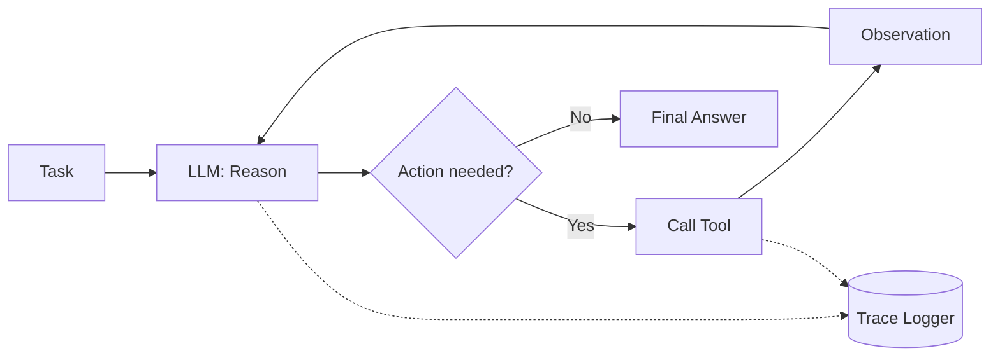

# LLM Agent From Scratch

A tool-using ReAct (Reason + Act) agent built **without any agent framework** — no
LangChain, no LangGraph, no CrewAI. The reasoning loop, tool-schema generation,
memory, evaluation harness, tracing, guardrails, and sandboxed code execution are
all hand-rolled, to demonstrate a real understanding of agent internals rather than
framework glue.


---

## Table of contents

- [Why from scratch?](#why-from-scratch)
- [What it does](#what-it-does)
- [Tools](#tools)
- [Architecture](#architecture)
- [Architecture highlights](#architecture-highlights)
- [Quickstart](#quickstart)
- [Usage examples](#usage-examples)
- [Verified results](#verified-results)
- [Project structure](#project-structure)
- [Design decisions & trade-offs](#design-decisions--trade-offs)
- [Known limitations](#known-limitations)
- [Roadmap](#roadmap)
- [License](#license)

---

## Why from scratch?

Agent frameworks hide the interesting parts: how tool calls actually get parsed out
of raw model output, what happens when the model returns malformed JSON, how you
enforce a step budget before the model does it for you, how you sandbox arbitrary
code execution safely. This project builds all of it directly, so every piece is
inspectable and explainable — down to the regex that parses the model's own output.

This mirrors the philosophy behind another project in my portfolio, an AlphaZero-style
chess engine built without a Stockfish wrapper: understanding the mechanism matters
more than assembling pre-built pieces.

## What it does

Given a task like *"What is 17 × (3 + 5)?"* or *"Search for the latest inflation
numbers and summarize them,"* the agent reasons step-by-step, decides which tool to
call, observes the result, and repeats until it reaches a final answer — all logged,
traced, and constrained by hard step/token budgets.



## Tools

| Tool | Description |
|---|---|
| `calculator` | Safe AST-based arithmetic evaluation — no bare `eval()` |
| `web_search` | Live search via the Tavily API; falls back to a clearly labeled mock if no key is set |
| `vector_lookup` | FAISS + sentence-transformers retrieval; falls back to keyword matching if those deps aren't installed |
| `code_exec` | Runs untrusted code in an ephemeral, non-root, network-disabled sibling Docker container |

Tool schemas are **not hand-written** — `src/tools/registry.py` auto-generates the
JSON schema each tool exposes to the model directly from its function signature and
docstring, so adding a new tool never means keeping two definitions in sync.

## Architecture

```
                     ┌──────────────────┐
   POST /run  ──────▶│   FastAPI (api/)  │
                     └────────┬─────────┘
                              │
                     ┌────────▼─────────┐
                     │  ReAct Loop       │◀──── golden_set.json (eval)
                     │  (src/agent/)     │
                     └────────┬─────────┘
                 ┌────────────┼────────────┐
                 │            │            │
          ┌──────▼───┐  ┌─────▼─────┐ ┌───▼────────┐
          │ Groq LLM │  │  Tools    │ │ Guardrails │
          │ wrapper  │  │ registry  │ │ (limits.py)│
          └──────────┘  └─────┬─────┘ └────────────┘
                               │
                     ┌─────────▼──────────┐
                     │  sandbox_exec       │
                     │  (sibling Docker    │
                     │   container)        │
                     └─────────────────────┘

Every step (thought / action / input / observation / tokens / latency)
is written as JSONL by src/trace/logger.py and replayed step-by-step
in the Streamlit viewer (viewer/app.py) on :8501.
```

## Architecture highlights

- **Hand-written ReAct parser** (`src/agent/loop.py`) — regex-based, with a retry
  loop that recovers from malformed model output instead of crashing the run.
- **Auto-generated tool schemas** (`src/tools/registry.py`) — derived from function
  signatures and docstrings, not hand-maintained.
- **Sandboxed execution** — `code_exec` dispatches to a sibling Docker container
  (Docker-out-of-Docker via the mounted host socket) rather than true
  Docker-in-Docker, avoiding privileged-mode/storage-driver complexity while still
  enforcing no network access, a non-root user, and resource/time limits.
- **Guardrails enforced in code** (`src/guardrails/limits.py`) — step count and
  token/cost ceilings are checked *before* every model call, not just requested via
  the system prompt.
- **Full observability** — every step is logged as JSONL and replayable step-by-step
  in a Streamlit trace viewer, including token usage and latency per step.
- **Eval harness** (`src/eval/`) — a hand-written golden set scored with rule-based
  checks (right tool called? completed within step budget?) plus an optional
  LLM-as-judge pass for open-ended tasks.
- **CI** (`.github/workflows/ci.yml`) — runs pytest and the eval suite on every push;
  the eval step is skipped gracefully if API key secrets aren't configured.

## Quickstart

```bash
git clone https://github.com/AnshumanJ28/LLM-agent.git
cd LLM-agent
cp .env.example .env        # add your GROQ_API_KEY (required); TAVILY_API_KEY is optional
pip install -r requirements.txt
docker build -t sandbox_exec -f docker/Dockerfile.sandbox .   # needed for code_exec
```

> `vector_lookup` works out of the box with keyword matching. If you want real
> embedding-based retrieval, uncomment `faiss-cpu` and `sentence-transformers` in
> `requirements.txt` before installing — note this pulls in `torch` and is a much
> heavier install.

## Usage examples

**Run a single task directly (no API, no Docker):**
```bash
python -c "
from src.agent.loop import run_agent
from src.tools.registry import get_tools
from src.tools import calculator, web_search, vector_lookup, code_exec
result = run_agent('What is 17 * (3 + 5)?', get_tools())
print(result.final_answer)
"
```

**Run the full stack (API + trace viewer):**
```bash
docker compose -f docker/docker-compose.yml up --build
```
- Agent API: `POST http://localhost:8000/run` with body `{"task": "..."}`
- Health check: `GET http://localhost:8000/health`
- Trace viewer: `http://localhost:8501`

Example request:
```bash
curl -X POST http://localhost:8000/run \
  -H "Content-Type: application/json" \
  -d '{"task": "What is 12 * 7?"}'
```

**Run the eval suite** (scores the agent against the golden set using live APIs):
```bash
python -m src.eval.run_eval
```

**Run tests:**
```bash
pytest tests/ -v
```

## Verified results

- **12/12 unit tests passing** (`tests/test_loop.py`, `tests/test_tools.py`) —
  covering response parsing (final answer / action / malformed / bad JSON), full-loop
  completion, step-limit enforcement, recovery from a tool exception, calculator
  correctness, and rejection of unsafe calculator input.
- **4/4 golden-set eval tasks passing** against live Groq + Tavily APIs:

  | Task | Tool | Steps | Tokens | Latency |
  |---|---|---|---|---|
  | `calc_1` | calculator | 2 | 823 | 1.86s |
  | `calc_2` | calculator | 2 | 847 | 0.92s |
  | `search_1` | web_search | 5 | 5,062 | 10.69s |
  | `code_1` | code_exec | 2 | 1,872 | 8.56s |

  `code_exec`'s latency is dominated by Docker container spin-up/teardown per call,
  not model reasoning time — a known trade-off of the sibling-container sandboxing
  approach (see below).

## Project structure

```
LLM-agent/
├── src/
│   ├── agent/          # loop.py (ReAct loop), llm_groq.py, memory.py
│   ├── tools/           # registry.py + calculator, web_search, vector_lookup, code_exec
│   ├── eval/             # golden_set.json, judge.py, run_eval.py
│   ├── trace/            # logger.py (JSONL step logging)
│   └── guardrails/       # limits.py (step/cost budgets, input sanitization)
├── api/                  # FastAPI wrapper (POST /run, GET /health)
├── viewer/                # Streamlit trace viewer
├── docker/                # Dockerfile.app, Dockerfile.sandbox, Dockerfile.viewer, compose
├── tests/                 # test_loop.py, test_tools.py
└── .github/workflows/      # CI: pytest + eval suite
```

See [`PROJECT-README.md`](./PROJECT-README.md) for the full original architecture
spec this was built from, including the build order and the reasoning behind every
design decision.

## Design decisions & trade-offs

- **Sibling containers, not Docker-in-Docker.** `code_exec` mounts the host's Docker
  socket to spawn sandbox containers as siblings rather than nesting Docker inside
  Docker. This is simpler to reason about and avoids privileged-mode requirements,
  at the cost of requiring host socket access — which is why it isn't suitable for
  most shared/free hosting platforms without a dedicated VM.
- **Regex parsing over structured output APIs.** The ReAct loop parses the model's
  raw text output with hand-written regex rather than relying on a provider's
  structured-output mode, so the parsing logic itself — including recovery from
  malformed output — is visible and testable.
- **Rule-based eval first, LLM-as-judge second.** Deterministic checks (right tool
  called, completed within budget) are the primary signal; LLM-as-judge is an
  optional layer for open-ended tasks where correctness isn't a simple string match.
- **Graceful degradation over hard dependencies.** Both `web_search` and
  `vector_lookup` fall back to simpler behavior (a labeled mock, or keyword
  matching) rather than crashing when an API key or optional dependency is missing.

## Known limitations

- `code_exec` requires access to the host Docker socket, so it won't work unmodified
  on most free PaaS platforms (Render, Fly.io, HuggingFace Spaces) — a dedicated VM
  with Docker installed is needed for a fully live public deployment of this tool.
- The eval golden set is intentionally small (4 tasks) — enough to validate each
  tool path works end-to-end, not a large-scale benchmark.
- `vector_lookup`'s keyword-matching fallback is meaningfully weaker than real
  embedding-based retrieval; enabling `faiss-cpu`/`sentence-transformers` is
  recommended for any serious retrieval use case.

## Roadmap

- [ ] Expand the golden set with more open-ended, LLM-judged tasks
- [ ] Add streaming responses from the FastAPI layer
- [ ] Multi-agent handoff (a second, specialized agent for long-form research tasks)

## License

MIT — see [`LICENSE`](./LICENSE).
